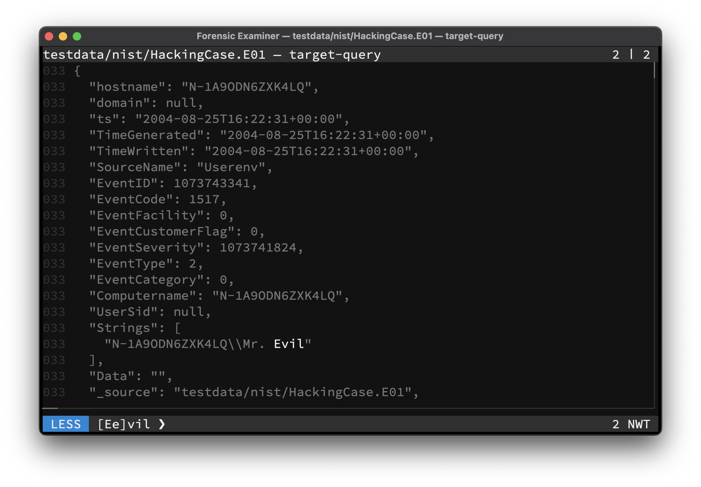

The Swiss Army Knife for examining text files. Combining the power of many traditional tools like **grep**, **hexdump** and **strings** with the possibilities of modern **LLMs**, to leverage your forensic examination process.



## Installation
```console
go install github.com/cuhsat/fox@latest
```

## Key Features
* Standalone native `AMD64` and `ARM64` binaries
* Available for Windows, Linux, macOS
* Available as `.apk`, `.deb`, `.rpm` package
* Multi core data handling for fast response times
* Memory mapped lazy loaded file handling
* In-memory forensic filesystem
* Prohibited file write access
* Path matching and globbing
* Unicode multi-byte support
* [Bidirectional character](https://nvd.nist.gov/vuln/detail/CVE-2021-42574) filtering
* UTC normalized timestamps
* Built-in scroll past end ability
* Built-in timestamped input history
* Built-in regular expression filtering
* Built-in dynamic context window
* Built-in canonical `hexdump` of files
* Built-in `wc` like counts with Shannon entropy
* Built-in `ASCII` and `Unicode` string carving
* Built-in IoC detection of `UUID`, `IPv4`, `IPv6`, `MAC`, `URL`, `Mail`
* Built-in parser for Linux systemd `journal` files
* Built-in parser for Windows event log `evtx` files
* Built-in sniffer for `csv` delimiter formats
* Built-in formating of: `csv`, `json`, `jsonl` data
* Built-in extraction of: `cab`, `rar`, `tar`, `zip`
* Built-in deflation of: `brotli`, `bzip2`, `gzip`, `lz4`, `xz`, `zlib`, `zstd`
* Built-in cryptographic hashes: `MD5`, `SHA1`, `SHA256`, `SHA3`, `SHA3-224`, `SHA3-256`, `SHA3-384`, `SHA3-512`
* Built-in similarity hashes: `SDHASH`, `SSDEEP`, `TLSH`
* Built-in checksums: `CRC32-IEEE`, `CRC64-ECMA`, `CRC64-ISO`
* Built-in in-memory RAG database for document embeddings
* Built-in AI agent using local [Ollama LLMs](https://ollama.com/search) like *Mistral* or *DeepSeek R1*
* Plugin support for e.g. the [Dissect](https://docs.dissect.tools) framework or [Eric Zimmerman's tools](https://ericzimmerman.github.io/)
* Evidence bag formats: `plain`, `text`, `json`, `jsonl`, `xml`, `sqlite3`
* Evidence bag chain of custody signing via `HMAC-SHA256`
* Evidence streaming using [Elastic Common Schema](https://www.elastic.co/docs/reference/ecs)
* Evidence streaming using [Splunk HTTP Event Collector](https://docs.splunk.com/Documentation/Splunk/latest/RESTREF/RESTinput)
* Terminal interface compatible with many terminals
    * Support for copy and bracketed paste
    * Support for mouse scrolling
    * Suspend to shell capability
    * Customizable color themes

## License
🦊 is released under the [GPL-3.0](LICENSE.md).
