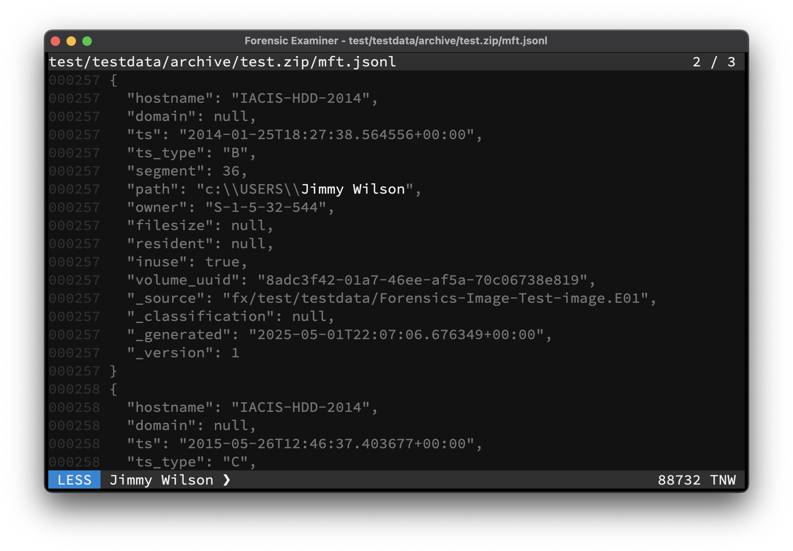

The Swiss Army Knife for examining text files. Combining the power of **cat**, **less**, **grep**, **hexdump**, **head**, **tail**, **wc**, and various decompression and hash algorithms into one performant standalone binary. As a forensic tool, no write access is made. For more information simply type `fox --help`.



# Install

```console
go install -tags=ui,ai github.com/cuhsat/fox@latest
```

# Features
* Customizable via feature flags
* Memory mapped lazy loading in support of big files
* Multi core data handling for fast response times
* Canonical hex view of binary files
* Regular expression filtering
* Unicode multi-byte support
* Unicode bidirectional character filtering
* Build-in decompression of: bzip2, gzip, tar, xz, zip, zstd
* Build-in cryptographic hashes: MD5, SHA1, SHA256, SHA3-512
* Build-in AI RAC support via langchain
* Build-in file statistics support
* Build-in input and output history
* Evidence bag formats: Text, XML, JSON, JSONL, Markdown
* Evidence bag cryptographic signing
* Graphical user interface
* Suspend to shell support
* Mouse scrolling support
* Full clipboard support
* Theme support including:
  *  Examiner-Light
  *  Examiner-Dark
  *  Catppuccin-Latte
  *  Catppuccin-Frappe
  *  Catppuccin-Macchiato
  *  Catppuccin-Mocha
  *  Solarized-Light
  *  Solarized-Dark
  *  VSCode-Light
  *  VSCode-Dark
  *  Monokai
  *  Darcula
  *  Nord
  *  Corporate
  *  Matrix
  *  Ansi16
  *  Monochrome
