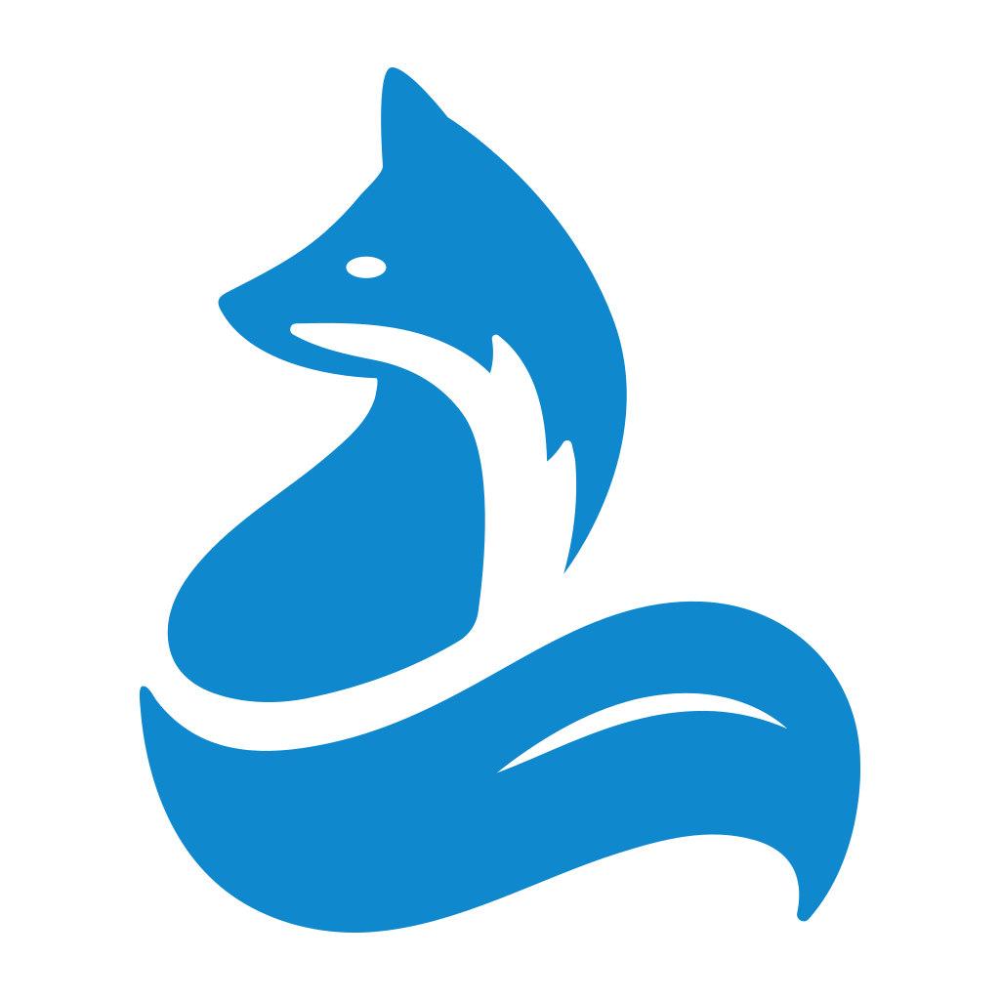
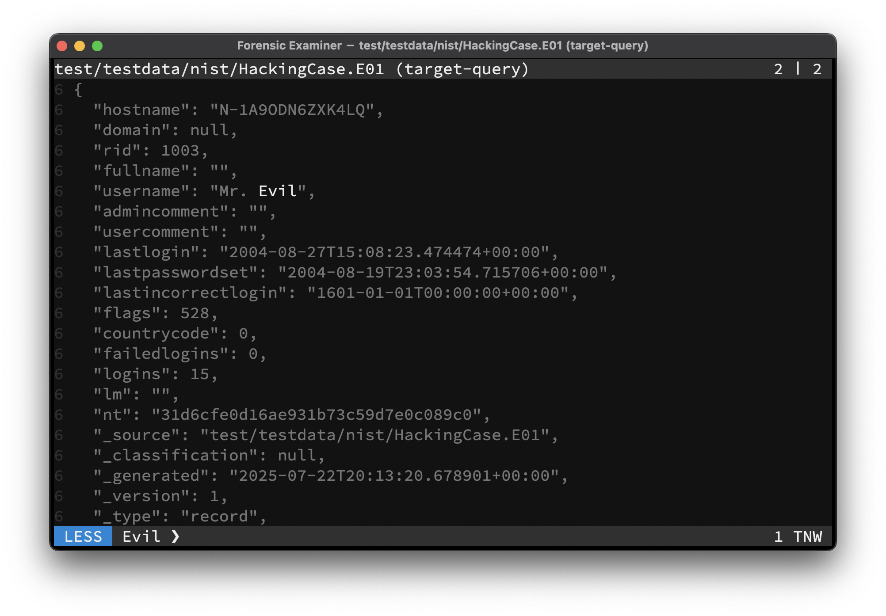

The Swiss Army Knife for examining text files. Combining the power of many traditional tools like **grep**, **hexdump** or **strings** with the possibilities of AI models, to leverage your forensic examining process.



```console
go install github.com/hiforensics/fox@latest
```

## Key features
* Available for [Windows / Linux / macOS](https://github.com/hiforensics/fox/releases)
* Standalone native `AMD64` and `ARM64` binaries 
* Multi core data handling for fast response times
* Memory mapped lazy loaded file handling
* In-memory virtual filesystem
* Prohibited file write access
* Path matching and globbing
* Unicode multi-byte support
* [Bidirectional character](https://nvd.nist.gov/vuln/detail/CVE-2021-42574) filtering
* Build-in scroll past end ability
* Build-in timestamped input history
* Build-in regular expression filtering
* Build-in dynamic context window
* Build-in canonical `hexdump` of files
* Build-in `wc` like counts with *Shannon* entropy
* Build-in string carving for `ASCII` and `Unicode`
* Build-in parser for Windows event log `EVTX` files
* Build-in sniffer for `CSV` delimiter formats
* Build-in formating of `CSV`, `JSON`, `JSONL` data
* Build-in decompression of: `brotli`, `bzip2`, `gzip`, `lz4`, `rar`, `tar`, `xz`, `zip`, `zlib`, `zstd`
* Build-in cryptographic hashes: `MD5`, `SHA1`, `SHA256`, `SHA3`, `SHA3-XYZ`
* Build-in fuzzy hashes: `SDHASH`, `SSDEEP`, `TLSH`
* Build-in in-memory only RAG database for document embeddings
* Build-in AI agent using local [Ollama LLMs](https://ollama.com/search) like *Mistral* or *DeepSeek R1*
* [Plugin](PLUGINS.md) support for e.g. the [Dissect](https://docs.dissect.tools) framework or [Eric Zimmerman's tools](https://ericzimmerman.github.io/)
* Evidence bag formats: `raw`, `text`, `JSON`, `JSONL`, `XML`, `SQLite3`
* Evidence bag signing via `HMAC-SHA256`
* Evidence streaming to server in [Elastic Common Schema 9.0](https://www.elastic.co/docs/reference/ecs)
* Terminal interface compatible with many terminals
  * With support for copy and bracketed paste
  * With support for mouse scrolling
  * With suspend to shell capability
  * With configurable color [themes](THEMES.md)

## License
Powered by 🥃 and released under the [GPL-3.0](LICENSE.md).