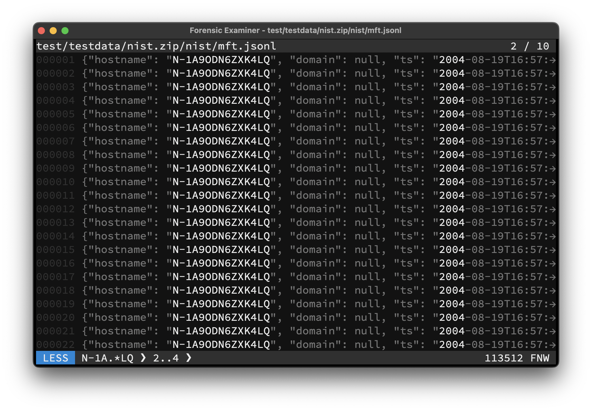

The Swiss Army Knife for examining text files. Combining the most useful functionalities from _zcat_, _zless_, _grep_, _hexdump_, _head_, _tail_, _wc_ and various cryptographic hash functions into one performant standalone binary.



```console
go install github.com/cuhsat/fx@latest
```

**Usage Examples**
> For more information type `fx --help`.

Examine the current dir

```console
fx
```

Examine directly from stdin

```console
fx -
```

Examine all `.jsonl` files in all sub dirs

```console
fx ./**/*.jsonl
```

Print all lines with `John Doe` from all files

```console
fx -p -e "John Doe"
```

Print the first `512` bytes to `mbr` in hex

```console
fx -x -h -c 512 nist.dd > mbr
```

Made with ❤ in Go