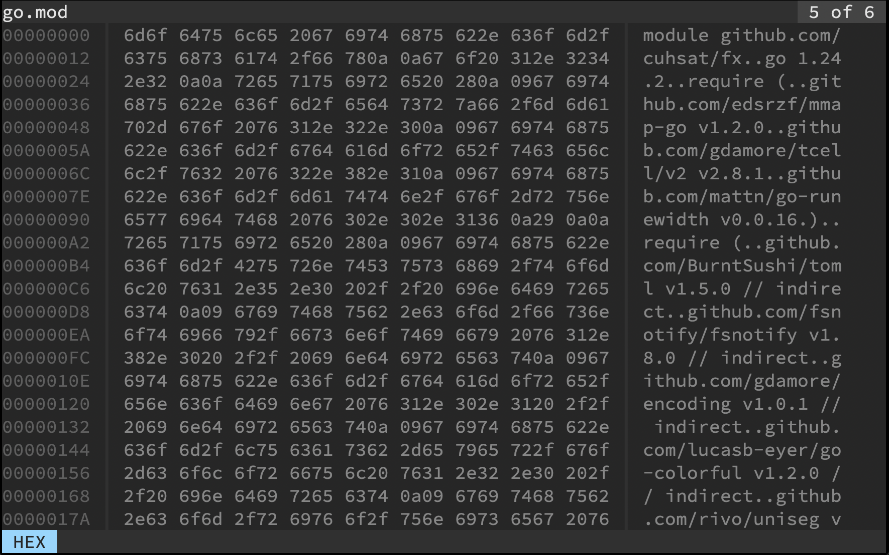

# 🔎 Forensic Examiner
The Swiss Army Knife for examining text files. Combining the most useful functionality from `(z)cat`, `(z)less`, `head`, `tail`, `grep`, `hexdump`, `sha256sum`, `sha1sum`, `md5sum`, `wc` and `jq` into one performant forensic tool.

> AS THIS IS A FORENSIC TOOL, NO WRITE ACCESS MUST BE GRANTED OR WILL BE USED.




## Install
```console
$ make install
```

## Usage
```
$ fx [-r] [-h | -t] [-n # | -c #] [-x | -e PATTERN] [-o FILE] [-b FILE] [PATH ... | -]
```

Available options:
* `-r` Raw
* `-h` Head limit
* `-t` Tail limit
* `-n` Lines count
* `-c` Bytes count
* `-x` Hexdump mode
* `-e` Pattern value
* `-o` Output file
* `-b` Evidence file

Standard options:
* `--help` Usage information
* `--version` Version number

## Keyboard

### General
| Shortcut                                             | Action                |
| ---------------------------------------------------- | --------------------- |
| <kbd>Esc</kbd>                                       | Exit                  |
| <kbd>F1</kbd> / <kbd>Ctrl</kbd> + <kbd>l</kbd>       | Less mode             |
| <kbd>F2</kbd> / <kbd>Ctrl</kbd> + <kbd>g</kbd>       | Grep mode             |
| <kbd>F3</kbd> / <kbd>Ctrl</kbd> + <kbd>x</kbd>       | Hex mode              |
| <kbd>F4</kbd> / <kbd>Ctrl</kbd> + <kbd>Space</kbd>   | Goto mode             |
| <kbd>F9</kbd>                                        | Show file(s) counts   |
| <kbd>F10</kbd>                                       | Show file(s) MD5      |
| <kbd>F11</kbd>                                       | Show file(s) SHA1     |
| <kbd>F12</kbd>                                       | Show file(s) SHA256   |
| <kbd>Tab</kbd>                                       | Load next file        |
| <kbd>Shift</kbd> + <kbd>Tab</kbd>                    | Load prev file        |
| <kbd>Shift</kbd> + <kbd>Up</kbd>                     | Scroll page up        |
| <kbd>Shift</kbd> + <kbd>Down</kbd>                   | Scroll page down      |
| <kbd>Shift</kbd> + <kbd>Left</kbd>                   | Scroll page left      |
| <kbd>Shift</kbd> + <kbd>Right</kbd>                  | Scroll page right     |
| <kbd>Ctrl</kbd> + <kbd>Shift</kbd> + <kbd>Up</kbd>   | Scroll to start       |
| <kbd>Ctrl</kbd> + <kbd>Shift</kbd> + <kbd>Down</kbd> | Scroll to end         |
| <kbd>Ctrl</kbd> + <kbd>r</kbd>                       | Reload file           |
| <kbd>Ctrl</kbd> + <kbd>q</kbd>                       | Close file            |
| <kbd>Ctrl</kbd> + <kbd>t</kbd>                       | Cycle themes          |
| <kbd>Ctrl</kbd> + <kbd>f</kbd>                       | Toggle file follow    |
| <kbd>Ctrl</kbd> + <kbd>n</kbd>                       | Toggle line numbers   |
| <kbd>Ctrl</kbd> + <kbd>w</kbd>                       | Toggle wrap text      |
| <kbd>Ctrl</kbd> + <kbd>s</kbd>                       | Save buffer content   |
| <kbd>Ctrl</kbd> + <kbd>c</kbd>                       | Copy buffer content   |

### Less Mode
| Shortcut                                             | Action                |
| ---------------------------------------------------- | --------------------- |
| <kbd>Space</kbd>                                     | Scroll page down      |

### Grep Mode
| Shortcut                                             | Action                |
| ---------------------------------------------------- | --------------------- |
| <kbd>Print</kbd> / <kbd>Ctrl</kbd> + <kbd>e</kbd>    | Save evidence in file |
| <kbd>Enter</kbd>                                     | Append filter         |
| <kbd>Backspace</kbd>                                 | Delete filter         |
| <kbd>Alt</kbd> + <kbd>Up</kbd>                       | Prev input in history |
| <kbd>Alt</kbd> + <kbd>Down</kbd>                     | Next input in history |
| <kbd>Ctrl</kbd> + <kbd>v</kbd>                       | Paste as input        |
| <kbd>Any Key</kbd>                                   | Filter buffer content |

## Config
> Located under `~/.fxrc`.

```toml
Theme = "Monokai"
Follow = true  # Follow file
Line = true    # Line numbers
Wrap = true    # Wrap text
```

### Environment
```console
FX_THEME=Monokai
```

### Themes
* `Monokai`
* `Catppuccin-Latte`
* `Catppuccin-Frappe`
* `Catppuccin-Macchiato`
* `Catppuccin-Mocha`
* `Ansi`
* `Matrix`
* `Monochrome`

---
Supported by [codecentric](https://codecentric.de) opt time.