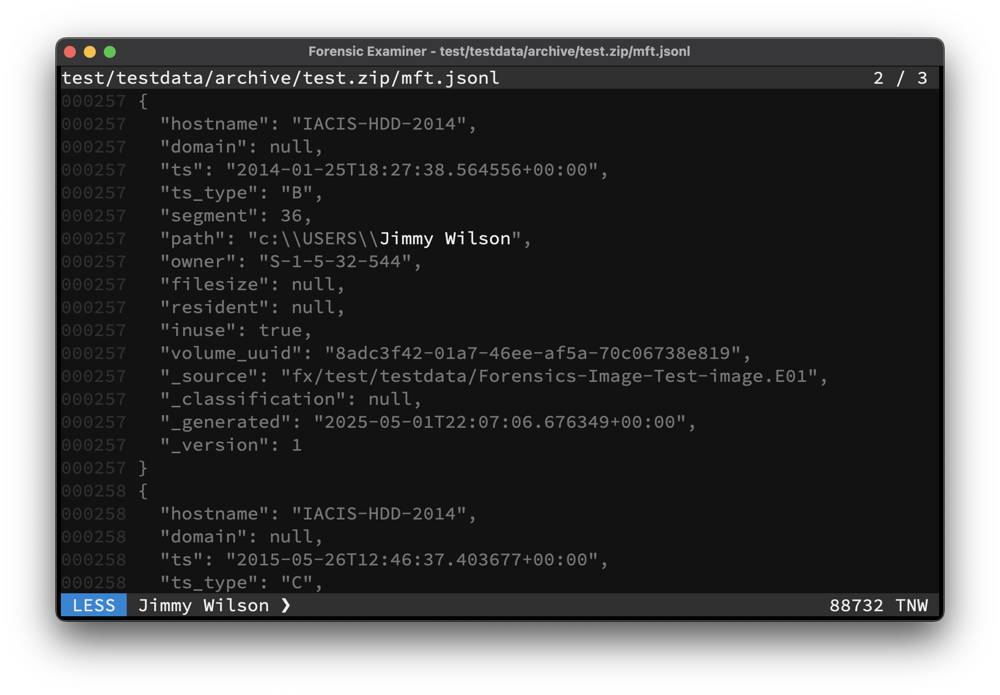

The Swiss Army Knife for examining text files. Combining the power of **cat**, **less**, **grep**, **hexdump**, **head**, **tail**, **strings**, **wc** and various decompression and cryptographic hash algorithms into one performant standalone binary. For more information simply type `fox --help`

```console
go install github.com/cuhsat/fox@latest
```



# Features
* Standalone native binary for AMD64 and ARM64
* Multi core data handling for fast response times
* Memory mapped lazy loaded files
* File write access is prohibited
* Unicode multi-byte support
* Unicode bidirectional character filtering (CVE-2021-42574)
* Build-in canonical hex view of files
* Built-in comma-separated value viewer
* Build-in regular expression filtering
* Build-in ASCII and Unicode string carving
* Build-in parser for Windows event log EVTX format
* Build-in decompression of: 7zip, brotli, bzip2, gzip, lz4, rar, tar, xz, zip, zlib, zstd
* Build-in cryptographic hashes: MD5, SHA1, SHA256, SHA3, SHA3-XXX
* Build-in timestamped input history
* Build-in wc like file content statistics
* Build-in plugin support for Fox-IT's Dissect or Eric Zimmerman's tools
* Evidence bag formats: Raw, JSON, JSONL, XML, SQLite
* Evidence bag signing via HMAC-SHA256 passphrase
* Terminal interface compatible with many terminals
  * With support for copy and bracketed paste
  * With support for mouse scrolling
  * With suspend to shell capability
  * With configurable color themes
  * Popular themes already included:
    * Examiner-Light
    * Examiner-Dark
    * Catppuccin-Latte
    * Catppuccin-Frappe
    * Catppuccin-Macchiato
    * Catppuccin-Mocha
    * Solarized-Light
    * Solarized-Dark
    * VSCode-Light
    * VSCode-Dark
    * Monokai
    * Darcula
    * Nord
    * Matrix
    * Monochrome
