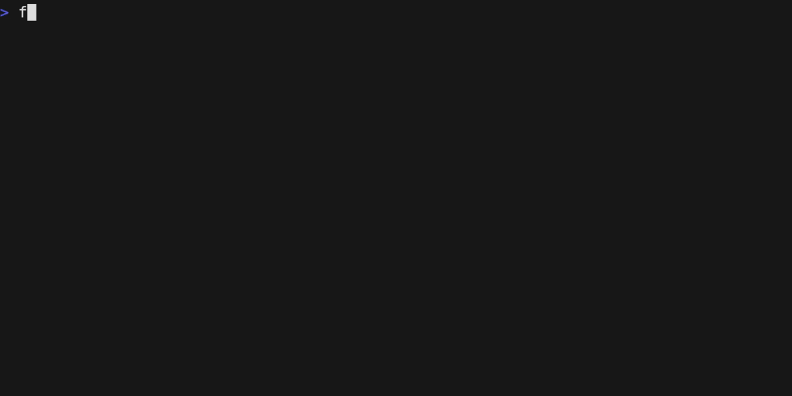

The Swiss Army Knife for examining text files. Combining the power of many traditional tools like **grep**, **hexdump** or **strings** with the possibilities of AI models, to leverage your forensic investigation process.



## Install
```console
go install github.com/hiforensics/fox@latest
```

## Features
* Standalone native binaries for AMD64 and ARM64
* Multi core data handling for fast response times
* Memory mapped lazy loaded file handling
* In-memory virtual filesystem
* Path pattern matching and globbing
* File write access is prohibited
* Unicode multi-byte support
* Unicode bidirectional character filtering ([CVE-2021-42574](https://nvd.nist.gov/vuln/detail/CVE-2021-42574))
* Build-in scroll past end ability
* Build-in canonical hex view of files
* Build-in regular expression filtering
* Build-in dynamic finding context window
* Build-in ASCII and Unicode string carving
* Build-in parser for Windows event log EVTX files
* Build-in sniffer for CSV delimiter formats
* Build-in formating of CSV, JSON, JSONL data
* Build-in decompression of: brotli, bzip2, gzip, lz4, rar, tar, xz, zip, zlib, zstd
* Build-in cryptographic hashes: MD5, SHA1, SHA256, SHA3, SHA3-XXX
* Build-in fuzzy hashes: SDHASH, SSDEEP, TLSH
* Build-in wc like counts with Shannon entropy
* Build-in timestamped input history
* Build-in AI agent using local Ollama LLMs like Mistral or DeepSeek R1
* Build-in AI agent in-memory RAG database for file embeddings
* [Plugin support](PLUGINS.md) for e.g. Eric Zimmerman's tools or Fox-IT's Dissect
* Evidence bag formats: Raw, Text, JSON, JSONL, XML, SQLite3
* Evidence bag signing via HMAC-SHA256 passphrase
* Evidence streaming to server in ECS 9.0 format
* Terminal interface compatible with many terminals
  * With support for copy and bracketed paste
  * With support for mouse scrolling
  * With suspend to shell capability
  * With configurable color themes
  * Popular themes already included:
    * Examiner-Dark
    * Examiner-Light
    * Catppuccin-Latte
    * Catppuccin-Frappe
    * Catppuccin-Macchiato
    * Catppuccin-Mocha
    * Solarized-Dark
    * Solarized-Light
    * VSCode-Dark
    * VSCode-Light
    * Monokai
    * Darcula
    * Nord
    * Matrix
    * Monochrome

## License
Released under the [GPL-3.0](LICENSE.md).