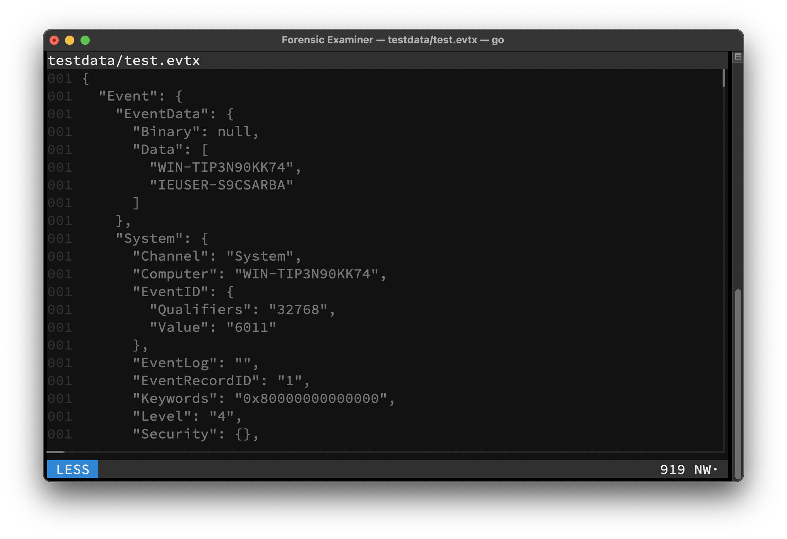
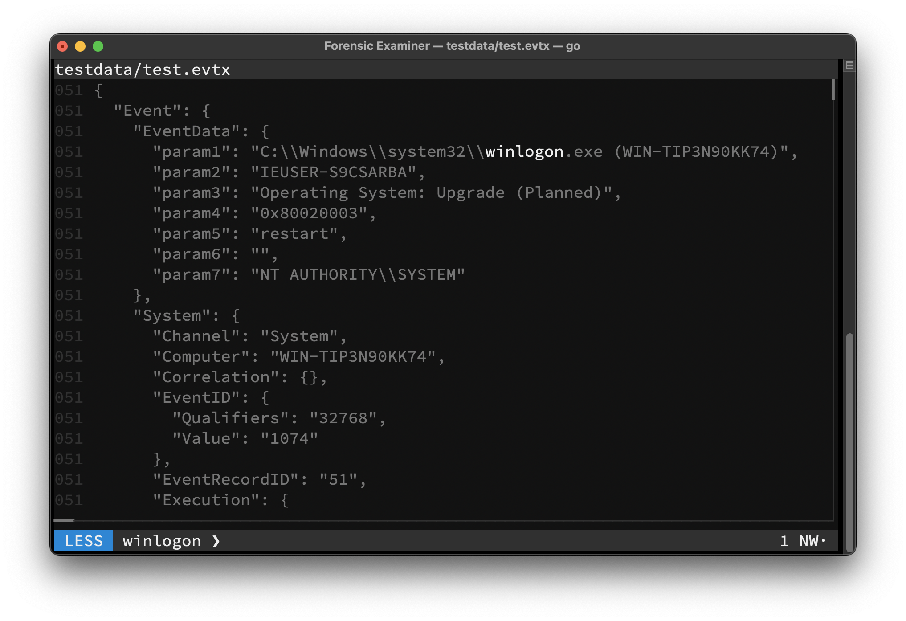
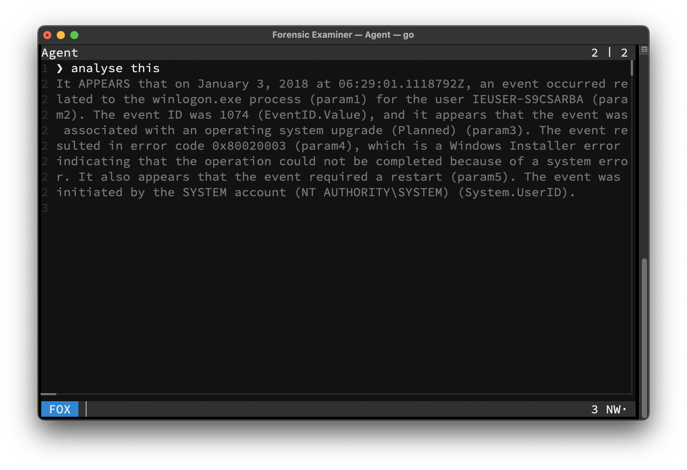
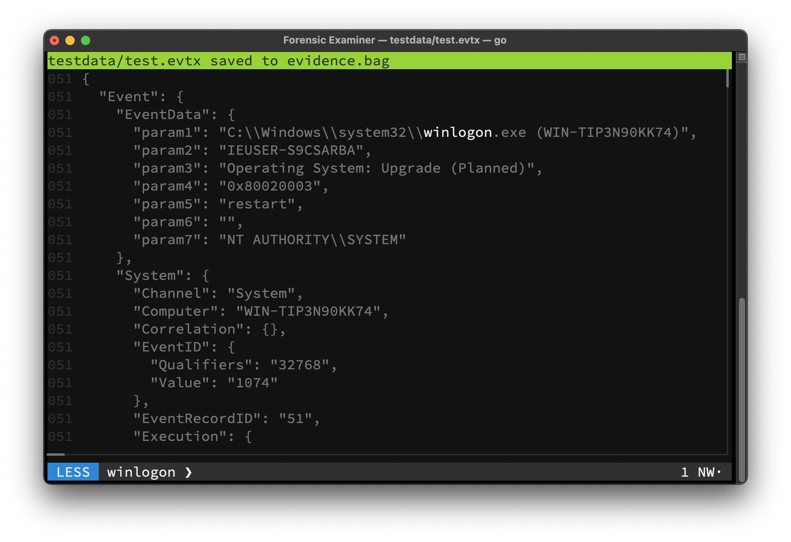

# Tutorial

## 1. Open File
Type the line below into your shell to open the UI:
```console
$ fox testdata/test.evtx
```



## 2. Search Artifacts
Start typing `winlogon` to switch to [GREP](../features/mode/grep.md) mode. Then press <kbd>Enter</kbd> to filter the file only for lines, that contain this expression:

```
winlogon
```



## 3. Analyse Artifacts
Use <kbd>Ctrl</kbd>+<kbd>F</kbd> to switch to [FOX](../features/mode/fox.md) mode and write your prompt for the AI [agent](../features/ai/agent.md) to answer. Then press <kbd>Enter</kbd> and wait for the agent respond:

```
analyse this
```

> If the model is not loaded into memory already, this step could take a few seconds.



## 4. Save Evidence
Press <kbd>Tab</kbd> to go back. Then use <kbd>Ctrl</kbd>+<kbd>S</kbd> to save all filtered lines into the [Evidence Bag](../features/evidence.md#evidence-bag). Press <kbd>Esc</kbd> twice, to exit the Forensic Examiner.


