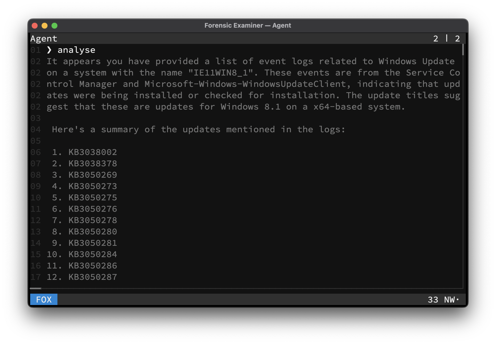

# FOX
All files can be analysed with **AI** support by switching to **FOX** mode. The last viewed file will be used as context.

> To switch to **FOX** mode use <kbd>Ctrl</kbd> + <kbd>F</kbd> while in the **UI**.

## Keymap
Mode specific keys:

| Key                                | Action                         |
|------------------------------------|--------------------------------|
| <kbd>Esc</kbd>                     | Switch to [LESS](less.md) mode |
| <kbd>Enter</kbd>                   | Query prompt                   |
| <kbd>Up</kbd>                      | Prev value in history          |
| <kbd>Down</kbd>                    | Next value in history          |
| <kbd>Left</kbd>                    | Move cursor left               |
| <kbd>Right</kbd>                   | Move cursor right              |
| <kbd>Ctrl</kbd> + <kbd>Left</kbd>  | Move cursor to start           |
| <kbd>Ctrl</kbd> + <kbd>Right</kbd> | Move cursor to end             |
| <kbd>Ctrl</kbd> + <kbd>V</kbd>     | Paste from clipboard           |
| *Any other key*                    | Define **LLM** prompt          |

## Example

