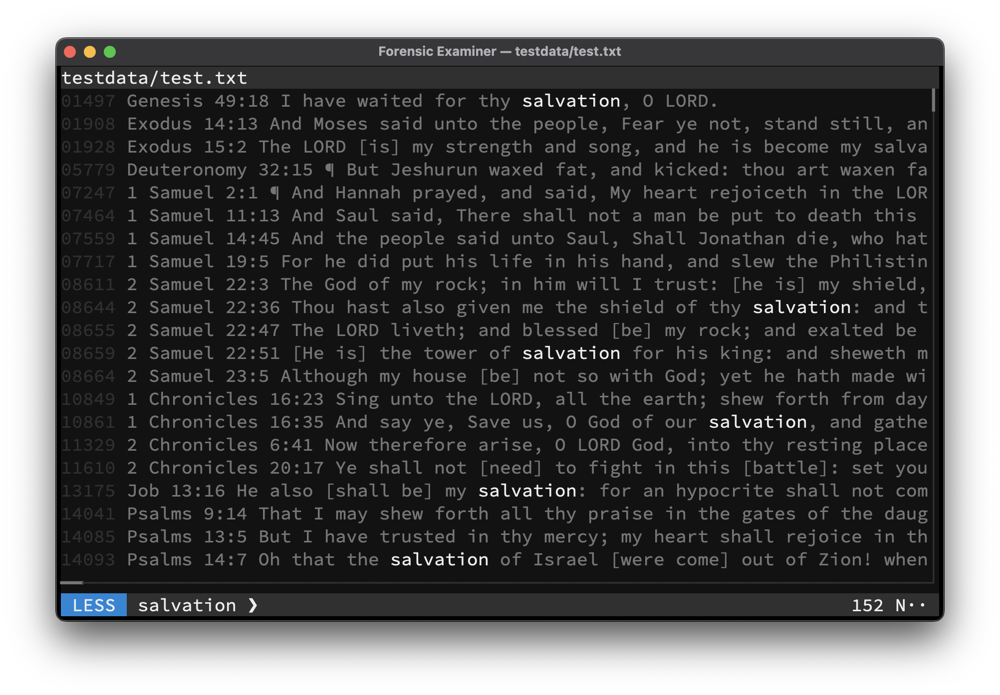

# GREP
All line-based files can be filtered with **Regular Expressions** by switching to **GREP** mode.

> To switch to **GREP** mode use <kbd>Ctrl</kbd> + <kbd>G</kbd> while in the **UI**, or type any letter or number while in **LESS** mode.

## Dynamic Context Window
This mode offers a dynamic context window, which can be changed on-the-fly for all filtered lines:

| Key                            | Action                  |
|--------------------------------|-------------------------|
| <kbd>Ctrl</kbd> + <kbd>K</kbd> | Increase context window |
| <kbd>Ctrl</kbd> + <kbd>J</kbd> | Decrease context window |

## Keymap
Mode specific keys:

| Key                                | Action                         |
|------------------------------------|--------------------------------|
| <kbd>Esc</kbd>                     | Switch to [LESS](less.md) mode |
| <kbd>Enter</kbd>                   | Append filter                  |
| <kbd>Backspace</kbd>               | Remove filter                  |
| <kbd>Up</kbd>                      | Prev value in history          |
| <kbd>Down</kbd>                    | Next value in history          |
| <kbd>Left</kbd>                    | Move cursor left               |
| <kbd>Right</kbd>                   | Move cursor right              |
| <kbd>Ctrl</kbd> + <kbd>Left</kbd>  | Move cursor to start           |
| <kbd>Ctrl</kbd> + <kbd>Right</kbd> | Move cursor to end             |
| <kbd>Ctrl</kbd> + <kbd>V</kbd>     | Paste from clipboard           |
| *Any other key*                    | Define **Regular Expression**  |

## Example

