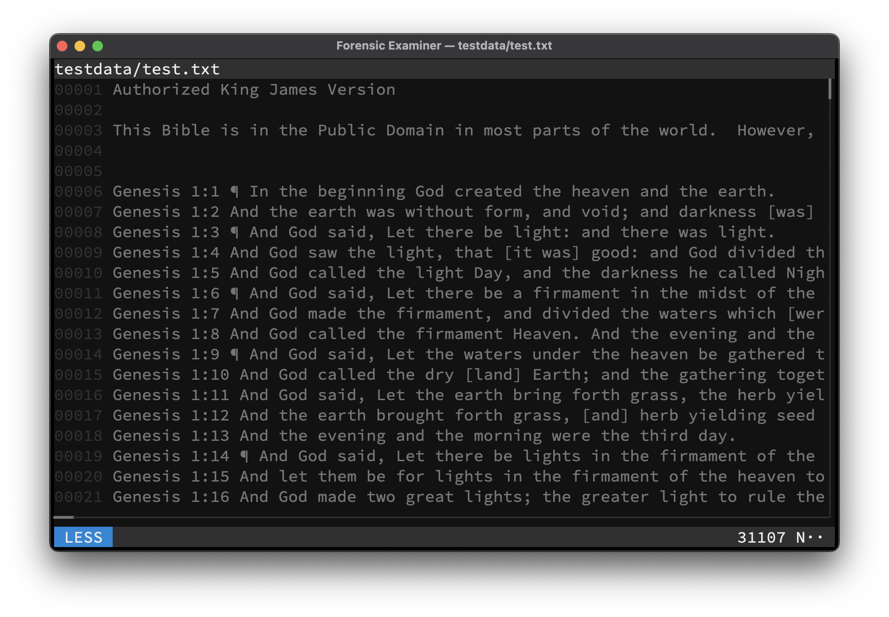

# LESS
All files can be viewed like in the **less** terminal pager by switching to **LESS** mode.

> To switch to **LESS** mode use <kbd>Ctrl</kbd> + <kbd>L</kbd> while in the **UI**.

## Keymap
Mode specific keys:

| Key              | Action                         |
|------------------|--------------------------------|
| <kbd>Enter</kbd> | Scroll one line down           |
| <kbd>Space</kbd> | Scroll one page down           |
| *Any other key*  | Switch to [GREP](grep.md) mode |

## Example

