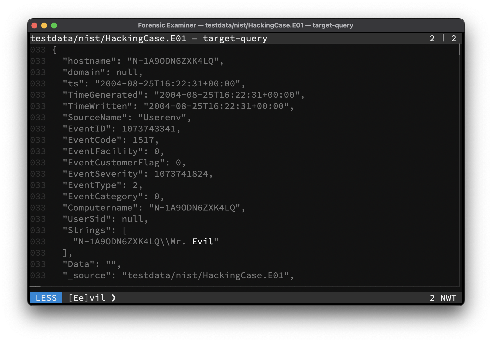

# Terminal
The terminal user interface is [compatible](https://github.com/gdamore/tcell) with many different common terminals, across all supported operating systems, like [iTerm2](https://iterm2.com/) or [Windows Terminal](https://github.com/microsoft/terminal).

> Use <kbd>Ctrl</kbd> + <kbd>Z</kbd> to suspend to shell while in the **UI**. Then type `exit` to resume the **UI**.

The **upper area** of the terminal shows the currently displayed file, any executed plugin and the current index and count of opened files.

The **lower area** of the terminal shows the current mode, any applied filters, the line count and the current UI state:

- `N` - show navigation
- `W` - wrap text
- `T` - tail file



## Features
Advanced terminal features:

- [Bracketed](https://en.wikipedia.org/wiki/Bracketed-paste) copy and paste
- 2-axis mouse wheel scrolling
- Scroll past end ability

> To turn off mouse support, use the `--no-mouse` flag. 

## Themes
The terminal user interface is fully customizable and has many popular color [themes](../../themes.md) are already integrated. Custom color themes can also be defined.

## History
All user input will be saved in a timestamped history file located under `~/.config/fox/history`.

> To prevent the history file of being written, use the `--readonly` flag.

```
1757110000;analyse
```

## Config
All **AI** and **UI** settings will be saved in a configuration file located under `~/.config/fox/foxrc`.

> To prevent the config file of being written, use the `--readonly` flag.

```toml
[ai]
model = 'deepseek-r1'
num_ctx = 4096
seed = 8211
temp = '0.2'
topk = 10
topp = '0.5'

[ui]
theme = 'Examiner-Dark'

[ui.state]
n = true
t = true
w = true
```
