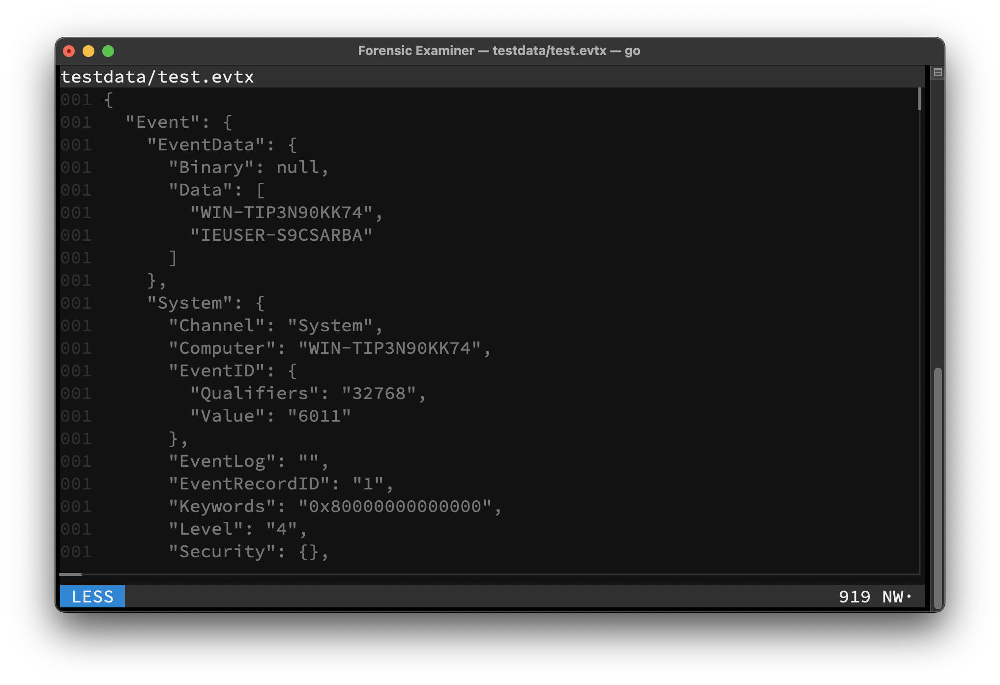
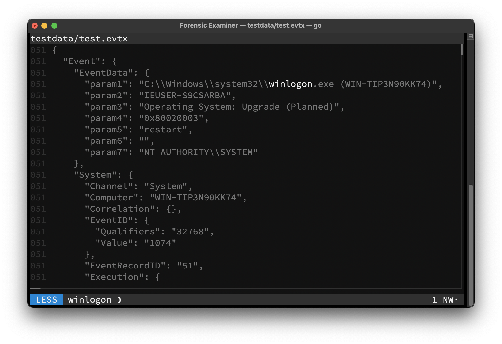
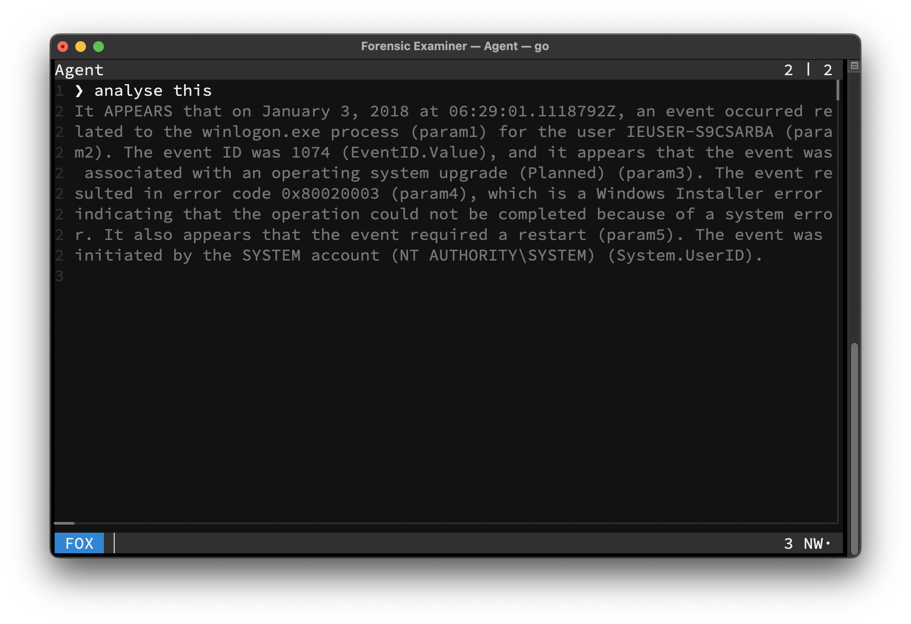
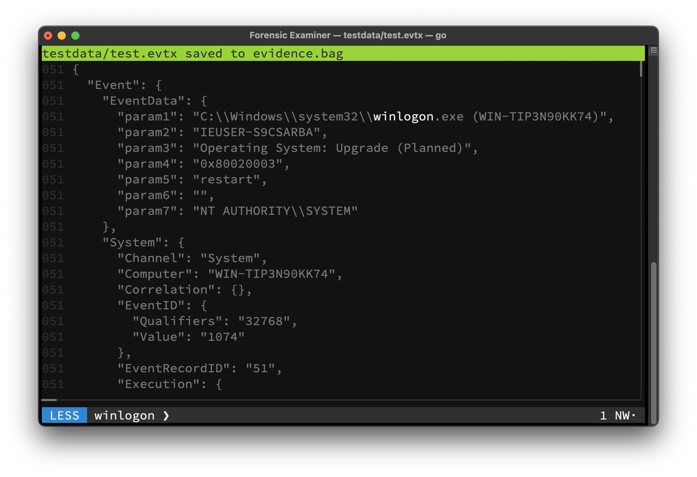

# Tutorial

## 1. Open File
Type the line below into your shell to open the UI:
```console
$ fox -T testdata/test.evtx
```



## 2. Search Artifacts
Start typing `winlogon` to switch to [GREP](../features/ui/mode/grep.md) mode. Then press <kbd>Enter</kbd> to filter the file only for lines, that contain this expression:

```
winlogon
```



## 3. Analyse Artifacts
Use <kbd>Ctrl</kbd>+<kbd>F</kbd> to switch to [FOX](../features/ui/mode/fox.md) mode and write your prompt for the AI [agent](../features/ai/agent.md) to answer. Then press <kbd>Enter</kbd> and wait for the agent respond:

```
analyse this
```

> If the model is not loaded into memory already, this step could take a few seconds.



## 4. Save Evidence
Press <kbd>Tab</kbd> to go back. Then use <kbd>Ctrl</kbd>+<kbd>S</kbd> to save all filtered lines into the [Evidence Bag](../features/evidence.md#evidence-bag). Press <kbd>Esc</kbd> twice, to exit the Forensic Examiner.



---

Contents of `./evidence.bag`:
```
 ___ ___  ___ ___ _  _ ___ ___ ___   _____  __  _   __  __ ___ _  _ ___ ___
| __/ _ \| _ \ __| \| / __|_ _/ __| | __\ \/ / /_\ |  \/  |_ _| \| | __| _ \
| _| (_) |   / _||  ' \__ \| | (__  | _| >  < / _ \| |\/| || ||  ' | _||   /
|_| \___/|_|_\___|_|\_|___/___\___| |___/_/\_\_/ \_\_|  |_|___|_|\_|___|_|_\

Forensic Examiner Evidence Bag (v2.42.3)

==============================================================================
File: /fox/testdata/test.evtx > winlogon (578112 bytes)
User: cuhsat (Christian Uhsat)
Time: 2025-09-12T18:12:43Z / 2025-08-29T00:25:10Z
Hash: f941c7ed118ff830439d25ca0407a047c03e58815baca2cf3c6b7b7f3d97d60f
------------------------------------------------------------------------------
51:0:{"Event":{"EventData":{"param1":"C:\\Windows\\system32\\winlogon.exe (WIN-TIP3N90KK74)","param2":"IEUSER-S9CSARBA","param3":"Operating System: Upgrade (Planned)","param4":"0x80020003","param5":"restart","param6":"","param7":"NT AUTHORITY\\SYSTEM"},"System":{"Channel":"System","Computer":"WIN-TIP3N90KK74","Correlation":{},"EventID":{"Qualifiers":"32768","Value":"1074"},"EventRecordID":"51","Execution":{"ProcessID":"332","ThreadID":"392"},"Keywords":"0x8080000000000000","Level":"4","Opcode":"0","Provider":{"EventSourceName":"User32","Guid":"{b0aa8734-56f7-41cc-b2f4-de228e98b946}","Name":"User32"},"Security":{"UserID":"S-1-5-18"},"Task":"0","TimeCreated":{"SystemTime":"2018-01-03T06:29:01.1118792Z"},"Version":"0"}}}
==============================================================================

```

Contents of `./evidence.bag.sig`:
```
gO8Idyc4TF0Hms+Zu/IALVEoybMZ7dqHnccnwvYBWH0=
```
