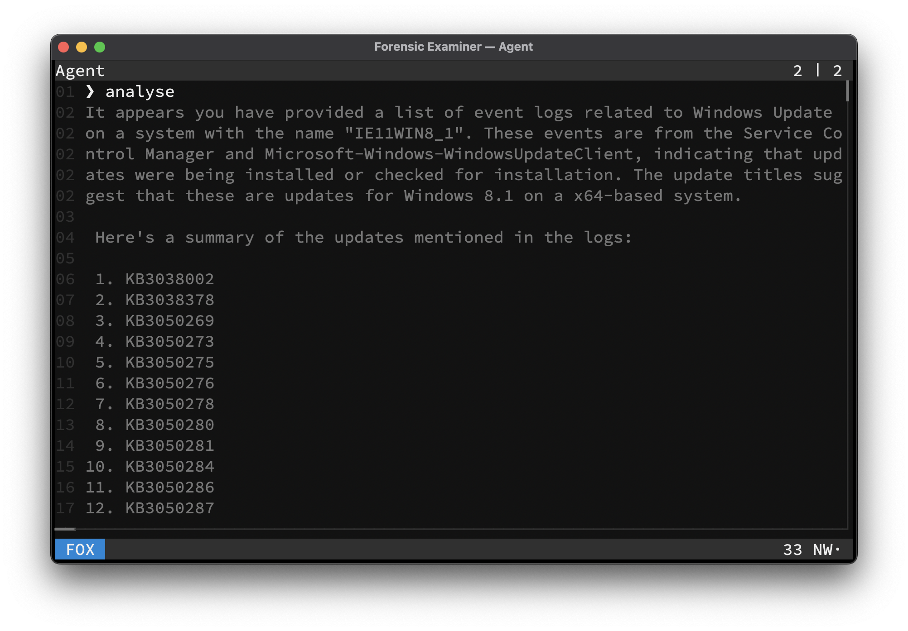

# Agent

In [FOX](../ui/mode/fox.md) mode, a chat agent is activated, to analyse line-based files. A running [Ollama](https://ollama.com) instance, locally or remote, is required for this functionality.

> The agent can also be executed per `--query` flag.

## LLM
The used model can be configured per user config or given per command line flag. For a list of supported models, please consult the [Ollama Model Library](https://ollama.com/search). It is advised to use at least a `7B` model like *Mistral* or *DeepSeek R1*.

## RAG
The given context will be split by lines and all lines will be embedded with the `nomic-embed-text` model into an in-memory only **Vector Database** as a document collection. A relevant subset of these documents will be retried by the LLM for generating the users chat response.

## Example

