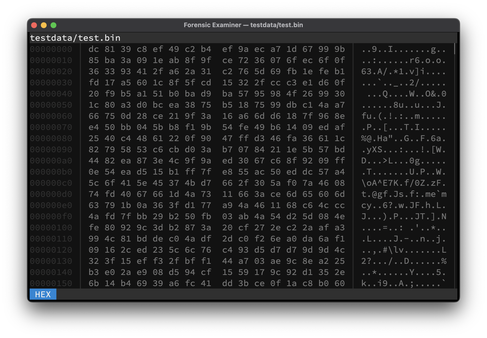

# HEX
All files can be viewed in the canonical **hexdump** format by switching to **HEX** mode.

> To switch to **HEX** mode use <kbd>Ctrl</kbd> + <kbd>X</kbd> while in the **UI**.

## Keymap
Mode specific keys:

| Key              | Action               |
|------------------|----------------------|
| <kbd>Enter</kbd> | Scroll one line down |
| <kbd>Space</kbd> | Scroll one page down |

## Example

