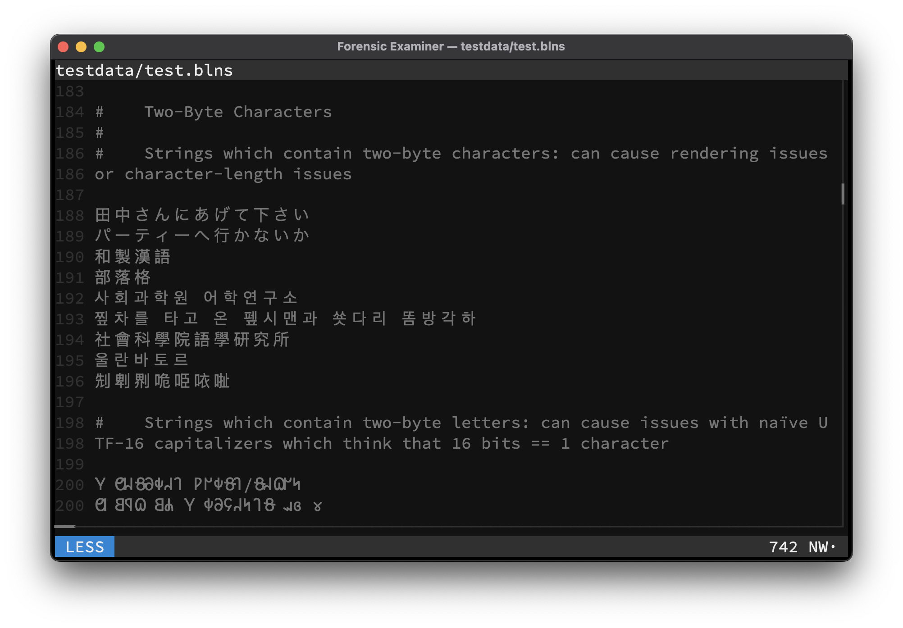

# Unicode
The terminal user interface is capable of rendering multibyte Unicode characters from many different languages, including most emojis.

## Security
To mitigate the known log file vulnerability [CVE-2021-42574](https://nvd.nist.gov/vuln/detail/CVE-2021-42574), all bidirectional Unicode characters will be filtered and displayed as `×` character.

## Example

