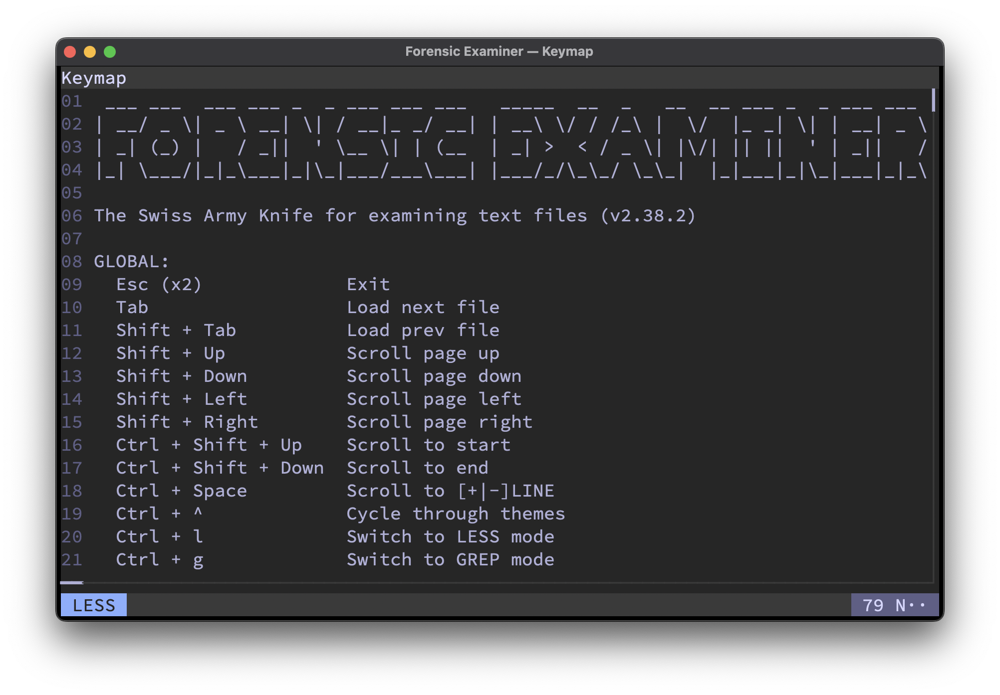

# Themes
Located under `~/.config/fox/themes`.

## Custom themes
All colors are hexadecimal encoded RGB values, where the first value defines the foreground color and the second one the background color.
```toml
[theme.custom]
name = 'custom'
terminal = [ 0xFFFFFF, 0x000000 ] # terminal
surface0 = [ 0xFFFFFF, 0x000000 ] # info panes
surface1 = [ 0xFFFFFF, 0x000000 ] # info areas
surface2 = [ 0xFFFFFF, 0x000000 ] # current file
surface3 = [ 0xFFFFFF, 0x000000 ] # current mode
overlay0 = [ 0xFFFFFF, 0x000000 ] # failure messages
overlay1 = [ 0xFFFFFF, 0x000000 ] # success messages
subtext0 = [ 0xFFFFFF, 0x000000 ] # navigation items
subtext1 = [ 0xFFFFFF, 0x000000 ] # separator lines
subtext2 = [ 0xFFFFFF, 0x000000 ] # highlights
```

## Built-in themes

### Examiner Dark


### Examiner Light


### Catppuccin Latte


### Catppuccin Frappe


### Catppuccin Macchiato


### Catppuccin Mocha


### Solarized Dark


### Solarized Light


### VSCode Dark


### VSCode Light


### Monokai


### Darcula


### Nord


### Matrix


### Monochrome

